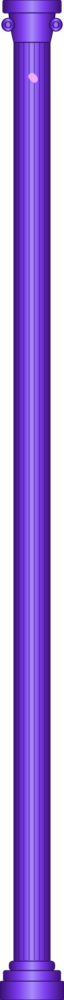

<!-- Bannière animée -->


<!-- Texte qui s'écrit tout seul -->
<div align="center">
  
</div>

<br>

<div align="center">
  <a href="https://olivier-dev-16.github.io"></a>
  
  
</div>

<br>

<!-- Mise en page : pilier à gauche | contenu à droite -->
<div style="display: flex; align-items: flex-start; gap: 40px;">
  
  <!-- Colonne de gauche : l'image fixe -->
  <div style="flex-shrink: 0; position: sticky; top: 20px;">
    
  </div>

  <!-- Colonne de droite : tout le reste du profil -->
  <div style="flex-grow: 1;">

## À propos de moi

Je suis étudiant en première année de **BTS SIO** (Services Informatiques aux Organisations).
Avant ça, j'ai fait de l'éco-gestion à l'université d'Angers, puis je me suis réorienté vers l'informatique.

Je débute en code et je ne m'en cache pas : ce profil, c'est un peu mon carnet de bord. J'y mets ce que j'apprends, ce que je construis, et il évoluera avec moi tout au long de ma formation.

```bash
$ cat moi.txt
nom        : Olivier
formation : BTS SIO, 1ère année
option    : SISR ou SLAM (je me décide en cours d'année)
parcours  : éco-gestion -> informatique
état      : toujours en train d'apprendre
